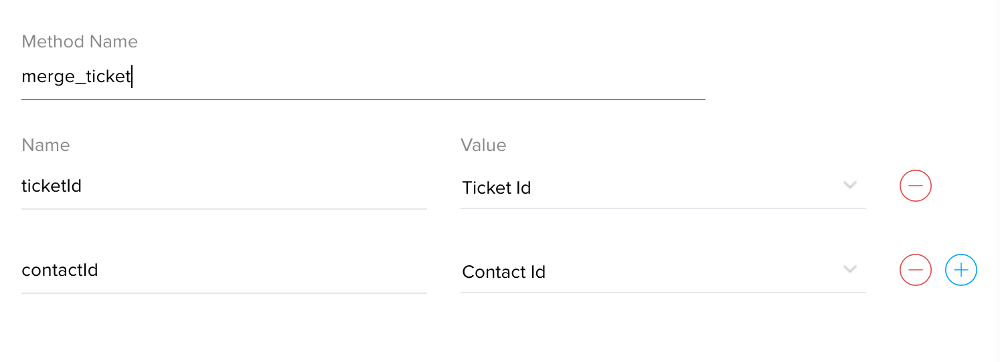

# Merge tickets from same contact based on contactId

## Description
Merge previous tickets from the contact with the newly created ticket based on contactId 


### Module : Tickets
### Workflow Trigger : On Create
Create workflow in Tickets module. 


### Workflow Action


### Arguments : 
* ticketId - Choose Ticket Id
* contactId - Choose Contact Id



## Deluge Script
```javascript
orgId = "12345"; //Replace ORGID
zohoSupportAuthtoken = "73a4c8b119**********f990fafcfe"; //Replace Desk API Authtoken
listOfTicketsResp = invokeurl
[
	url :"https://desk.zoho.com/api/v1/contacts/"+contactId+"/tickets"
	type :GET
	headers:{"orgId":orgId,"Authorization":"Zoho-authtoken " + zohoSupportAuthtoken}
];
dataSize = listOfTicketsResp.get("data").size();
if(dataSize > 0)
{
	mergeTicketID = ticketId;
	listOfTickets = listOfTicketsResp.get("data");
	for each  ticket in listOfTickets
	{
		parameterMap = {"ids":{ticket.get("id")}};
		mergeTicket = invokeurl
		[
			url :"https://desk.zoho.com/api/v1/tickets/" + mergeTicketID + "/merge"
			type :POST
			parameters:parameterMap.toString()
			headers:{"orgId":orgId,"Authorization":"Zoho-authtoken " + zohoSupportAuthtoken,"Content-Type":"application/json"}
		];
		if(mergeTicket != null && mergeTicket.get("id") != null)
		{
			mergeTicketID = mergeTicket.get("id");
		}
	}
}

```

## Notes
Replace the OrgId and Authtoken in the script.


## FAQ
### How to get OrgId?
see [Organizations API documentation](https://desk.zoho.com/support/APIDocument.do#Organizations)

### How to get AgentId?
see [Agents API documentation](https://desk.zoho.com/support/APIDocument.do#Agents#Agents_Listagents)

### How to get Authtoken?
Get [Authtoken](https://accounts.zoho.com/apiauthtoken/create?SCOPE=ZohoSupport/supportapi,ZohoSearch/SearchAPI)

### How to get tickets by contactId?
see [List tickets by contact API documentation](https://desk.zoho.com/support/APIDocument.do#Contacts#Contacts_Listticketsbycontact)

### How to merge tickets?
see [Merge tickets API documentation](https://desk.zoho.com/support/APIDocument.do#Tickets#Tickets_Mergetwotickets)

## Help Urls
[Deluge Script](https://www.zoho.com/deluge/help/)

[DRE Functions](https://dre.zoho.com/help/)

[Desk API Documentation](https://desk.zoho.com/support/APIDocument.do)

[Desk Integration Tasks](https://www.zoho.com/deluge/help/desk-tasks.html)
