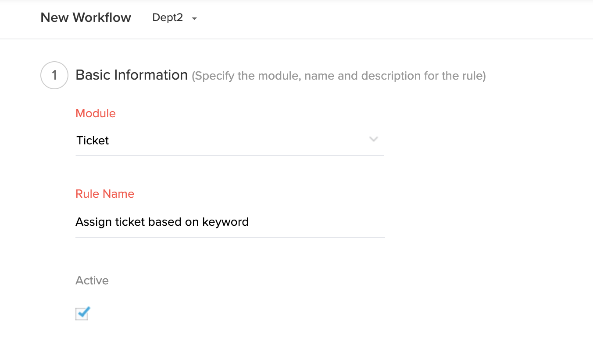
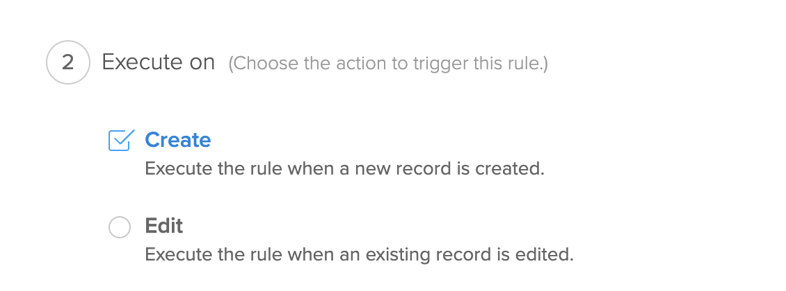
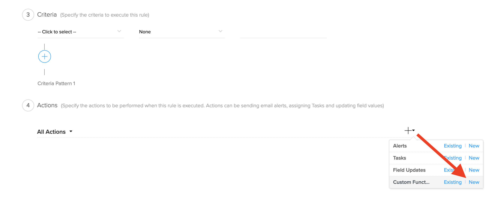
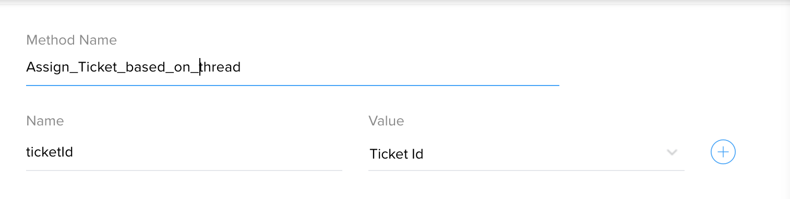

# Assign Ticket based on keyword in Ticket thread content

## Description
Search for a keyword in ticket thread content and assign ticket based on that


### Module : Tickets
### Workflow Trigger : On Create
Create workflow in Tickets module. 





### Workflow Action


### Arguments : 
* ticketId - Choose Ticket Id



## Deluge Script
```javascript
ORGID = 12345; // Replace OrgId
ticketThreads = zoho.desk.getRelatedRecords(ORGID,"threads","tickets",ticketId);
latestThreadId = ticketThreads.get("data").get(0).get("id");
latestThread = zoho.desk.getRelatedRecordById(ORGID,"threads",latestThreadId,"tickets",ticketId);
latestThreadContent = latestThread.get("content");
agentToAssign = "none";
if(latestThreadContent.containsIgnoreCase("iphone"))
{
	agentToAssign = "146284000003395009"; // Replace AgentId
}
else if(latestThreadContent.containsIgnoreCase("macbook"))
{
	agentToAssign = "146284000005551017"; // Replace AgentId
}

if(agentToAssign != "none")
{
	updateTicketData = {"assigneeId":agentToAssign};
	info zoho.desk.update(ORGID,"tickets",ticketId,updateTicketData);
}
```

## Notes
This function uses Desk Integration Tasks. Replace the agentIds in the script.


## FAQ
### How to get OrgId?
see [Organizations API](https://desk.zoho.com/support/APIDocument.do#Organizations)

### How to get AgentId?
see [Agents API](https://desk.zoho.com/support/APIDocument.do#Agents#Agents_Listagents)


## Help Urls
[Deluge Script](https://www.zoho.com/deluge/help/)

[DRE Functions](https://dre.zoho.com/help/)

[Desk API Documentation](https://desk.zoho.com/support/APIDocument.do)

[Desk Integration Tasks](https://www.zoho.com/deluge/help/desk-tasks.html)
