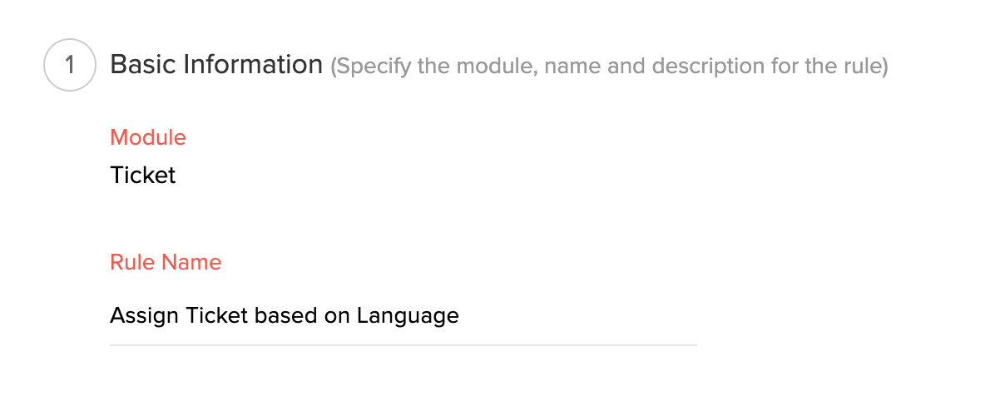
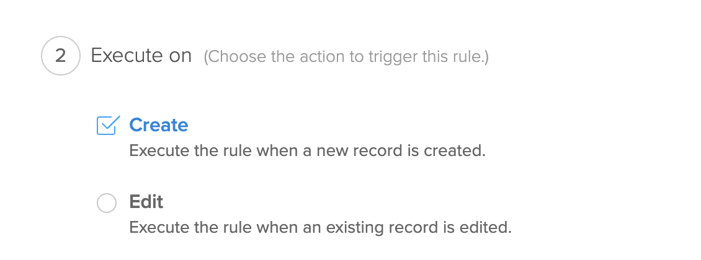
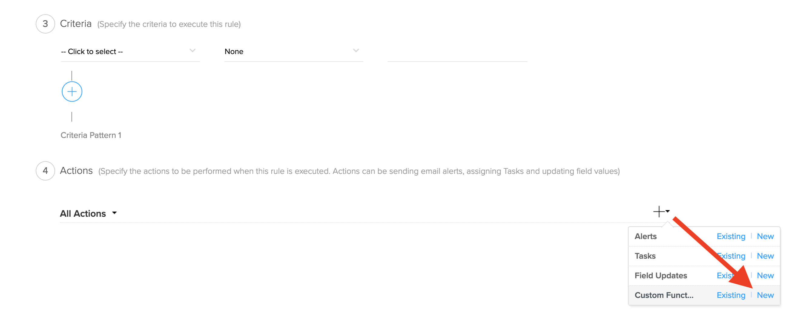
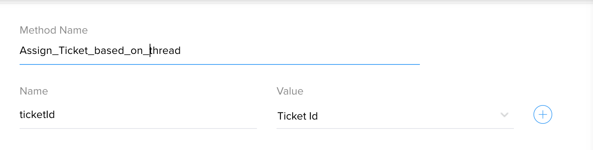

# Assign Ticket based on language in Ticket thread content

## Description
Checks the thread content language and assigns the ticket.


### Module : Tickets
### Workflow Trigger : On Create
Create workflow in Tickets module. 





### Workflow Action


### Arguments : 
* ticketId - Choose Ticket Id



## Deluge Script
```javascript
ORGID = 12345; // Replace OrgId
ticketThreads = zoho.desk.getRelatedRecords(ORGID,"threads","tickets",ticketId);
latestThreadSummary = ticketThreads.get("data").get(0).get("summary");
prediction = zoho.ai.predictLanguage(latestThreadSummary.left(100));
lang = prediction.get("data").get("items").get(0).get("predictionProbabilities").keys().get(0);
langAssignMap = {"mt":"146284000000065005","lt":"146284000003395009","lv":"146284000005551017"}; //Replace 'language codes' and 'agentIds' 
agentToAssign = langAssignMap.get(lang);
if(agentToAssign != null)
{
	updateTicketData = {"assigneeId":agentToAssign};
	zoho.desk.update(ORGID,"tickets",ticketId,updateTicketData);
}

```

## Notes
This function uses Desk Integration Tasks. Replace the 'language codes' and 'agentIds' in the script.


## FAQ
### How to get OrgId?
see [Organizations API](https://desk.zoho.com/support/APIDocument.do#Organizations)

### How to get AgentId?
see [Agents API](https://desk.zoho.com/support/APIDocument.do#Agents#Agents_Listagents)


## Help Urls
[Deluge Script](https://www.zoho.com/deluge/help/)

[DRE Functions](https://dre.zoho.com/help/)

[Desk API Documentation](https://desk.zoho.com/support/APIDocument.do)

[Desk Integration Tasks](https://www.zoho.com/deluge/help/desk-tasks.html)
