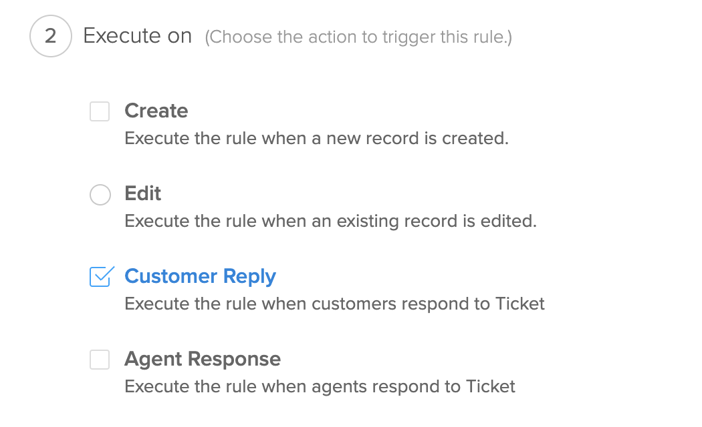
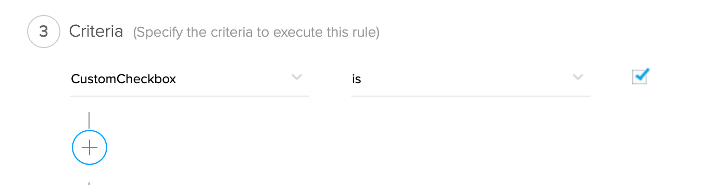
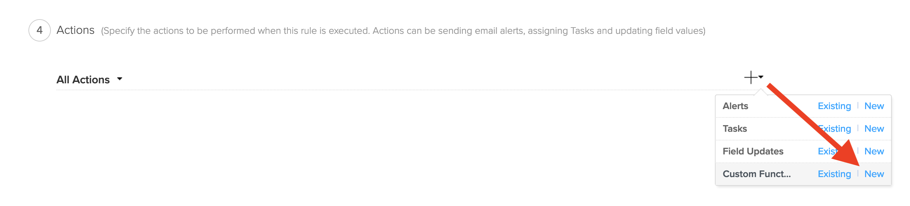
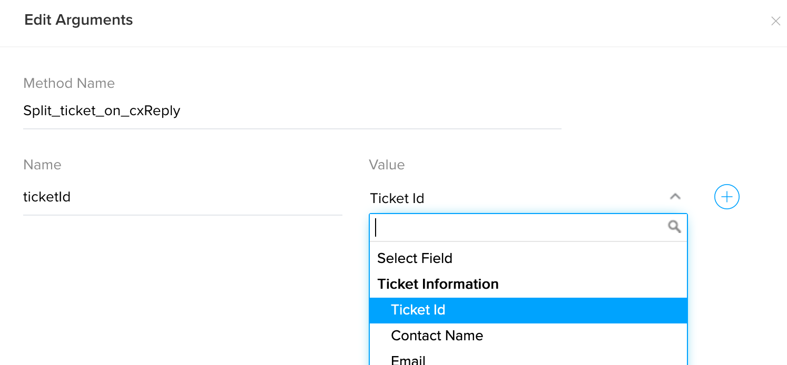

# Split Ticket on customer reply once the ticket is marked as permanently closed

## Description
Once the ticket is marked as permanently closed, the customer reply to that ticket will be splitted to a new ticket.

### Prerequisites
We use a ticket custom Checkbox field to know whether the ticket is permanently closed or not (regardless of the ticket status). So create a custom checkbox field named `CustomCheckbox` in tickets module.

Setup > Layouts and Fields > Edit Layout > Drag-n-Drop the field > Save & Close


### Module : Tickets
### Workflow Trigger : On Customer Reply
Create workflow in Tickets module. 



### Workflow Criteria
> "CustomCheckbox IS Checked"


### Workflow Action


### Arguments : 
* ticketId - Choose Ticket Id



## Deluge Script
```javascript
ORGID = 123456; // Replace OrgId
ticketThreads = zoho.desk.getRelatedRecords(ORGID, "threads", "tickets", ticketId);
latestThreadId = ticketThreads.get("data").get(0).get("id");
splitTicketResponse = zoho.desk.ticket.split(ORGID, ticketId, latestThreadId);
updateTicketData = {"status":"Closed"};
zoho.desk.update(ORGID, "tickets", ticketId, updateTicketData);
```

## Notes
This function uses Desk Integration Tasks. This function assumes that the ticket is permanantly closed once CustomCheckbox is checked (no matter what the ticket status is).

## FAQ
### How to get OrgId?
see [Organizations API](https://desk.zoho.com/support/APIDocument.do#Organizations)


## Help Urls
[Deluge Script](https://www.zoho.com/deluge/help/)

[DRE Functions](https://dre.zoho.com/help/)

[Desk API Documentation](https://desk.zoho.com/support/APIDocument.do)

[Desk Integration Tasks](https://www.zoho.com/deluge/help/desk-tasks.html)
