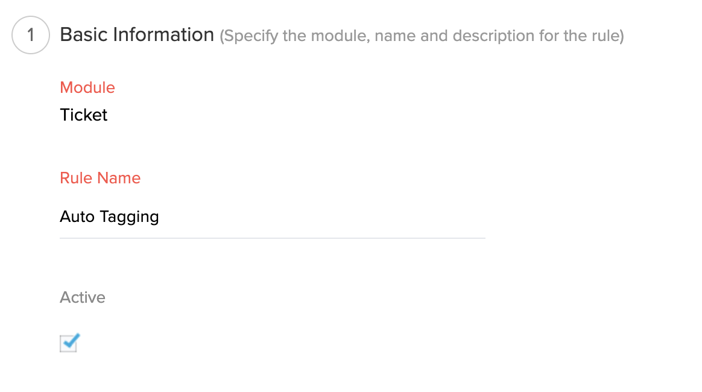
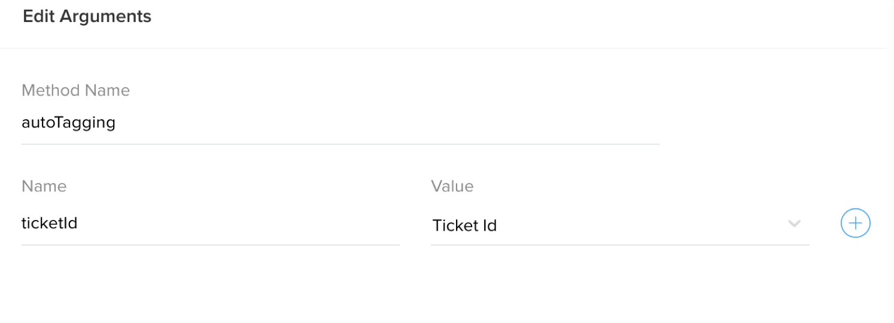

# Add Tags to the ticket based on the thread content

## Description
Gets the latest thread content and searches for the keywords and adds the tag to ticket based on the keyword 


### Module : Tickets
### Workflow Trigger : On Create
Create workflow in Tickets module. 




### Workflow Action


### Arguments : 
* ticketId - Choose Ticket Id



## Deluge Script
```javascript

orgId = "12345";
zohoSupportAuthtoken = "2########dfba#####febd77#######cb";//replace DESK API Authtoken
//Search_keyword and tag_name mapping
TagMapping = Map();
//TagMapping.put("<search_Key>","<Tag_Name>");
TagMapping.put("Refund","refund");
TagMapping.put("Instructions","instructions");
TagMapping.put("Feedback","feedback");
TagMapping.put("Cancellation","Cancel");
getThreadDetails = invokeurl
[
	url :"https://desk.zoho.com/api/v1/tickets/" + ticketId + "/latestThread?include=plainText"
	type :GET
	headers:{"orgId":orgId,"Authorization":"Zoho-authtoken " + zohoSupportAuthtoken}
];
threadContentInLowercase = getThreadDetails.get("plainText").toLowerCase();
tagParam = List();
searchKeys = TagMapping.keys();
for each  searchKey in searchKeys
{
	if(threadContentInLowercase.getOccurenceCount(searchKey.toLowerCase()) > 0)
	{
		tagParam.add(TagMapping.get(searchKey));
	}
}
if(!tagParam.isEmpty())
{
	jsonString = {"tags":tagParam};
	addTicketTag = invokeurl
	[
		url :"https://desk.zoho.com/api/v1/tickets/" + ticketId + "/associateTag"
		type :POST
		parameters:jsonString.toString()
		headers:{"orgId":orgId + "","Authorization":"Zoho-authtoken " + zohoSupportAuthtoken}
	];
}

```

## Notes
Replace the OrgId and Authtoken in the script.


## FAQ
### How to get OrgId?
see [Organizations API documentation](https://desk.zoho.com/support/APIDocument.do#Organizations)


### How to get Authtoken?
Get [Authtoken](https://accounts.zoho.com/apiauthtoken/create?SCOPE=ZohoSupport/supportapi,ZohoSearch/SearchAPI)

### How to get latest thread?
see [Get latest thread API documentation](https://desk.zoho.com/support/APIDocument.do#Threads#Threads_GetLatestthread)

## Help Urls
[Deluge Script](https://www.zoho.com/deluge/help/)

[DRE Functions](https://dre.zoho.com/help/)

[Desk API Documentation](https://desk.zoho.com/support/APIDocument.do)

[Desk Integration Tasks](https://www.zoho.com/deluge/help/desk-tasks.html)
