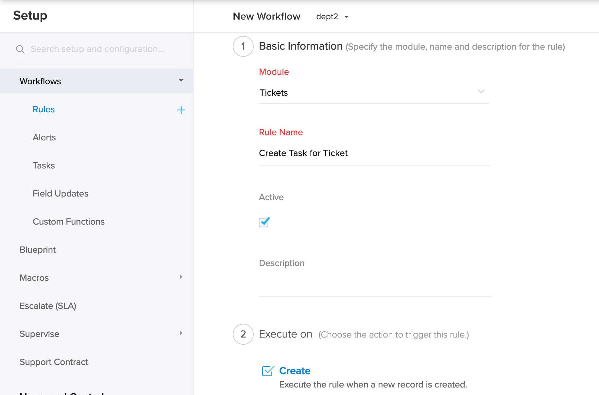
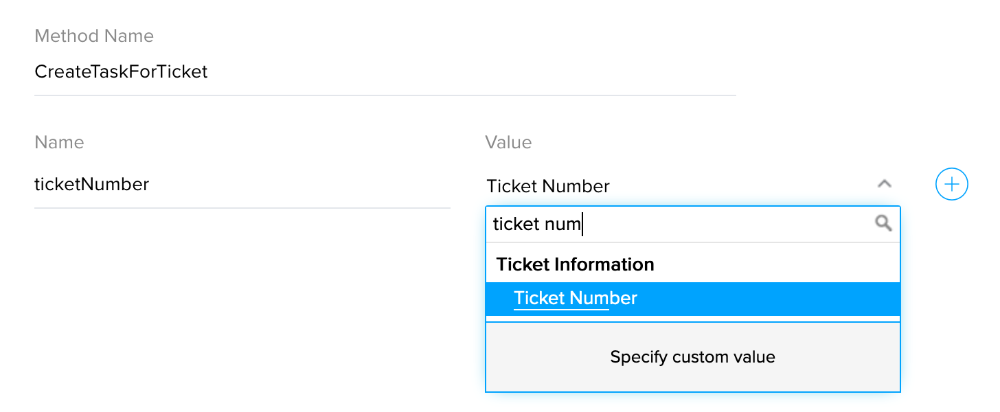
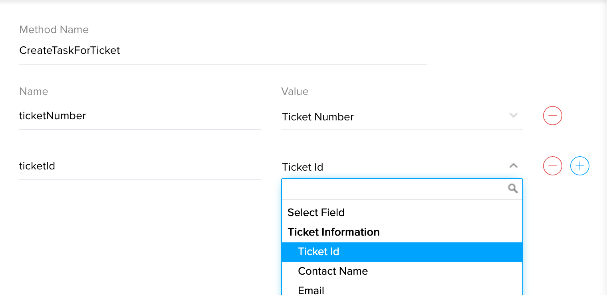

# Create Task when a Ticket is created and Associate task to ticket.

## Description
On ticket creation, a task is created and associated to the ticket.


### Module : Tickets
### Workflow Trigger : On Create
Create workflow in Tickets module. 



### Workflow Action


### Arguments : 
* ticketId - Choose Ticket Id
* ticketNumber - Choose Ticket Number




## Deluge Script
```javascript
ORGID = 123456; // Replace OrgId
taskCreateData = Map();
taskCreateData.put("subject", "Task for #" + ticketNumber);
taskCreateData.put("departmentId", "60909000000208045"); // Replace departmentId
taskCreateData.put("dueDate", "2020-07-21T16:16:16.000Z"); // Replace dueDate
taskCreateData.put("priority", "High");
taskCreateData.put("status", "Not Started");
taskCreateData.put("ticketId", ticketId);
zoho.desk.create(ORGID, "tasks", taskCreateData);
```

## Notes
This function uses Desk Integration Task for Creating the task. By passing 'ticketId', task gets associated to the ticket.

## FAQ
### How to get OrgId?
see [Organizations API](https://desk.zoho.com/support/APIDocument.do#Organizations)

### How to get department Id?
see [List Departments API](https://desk.zoho.com/support/APIDocument.do#Departments#Departments_Listdepartments)

### How to set duedate?
Enter the dates in the ISO date format of 'yyyy-MM-ddThh:mm:ss.SSSZ


## Help Urls
[Deluge Script](https://www.zoho.com/deluge/help/)

[DRE Functions](https://dre.zoho.com/help/)

[Desk API Documentation](https://desk.zoho.com/support/APIDocument.do)

[Desk Integration Tasks](https://www.zoho.com/deluge/help/desk-tasks.html)
