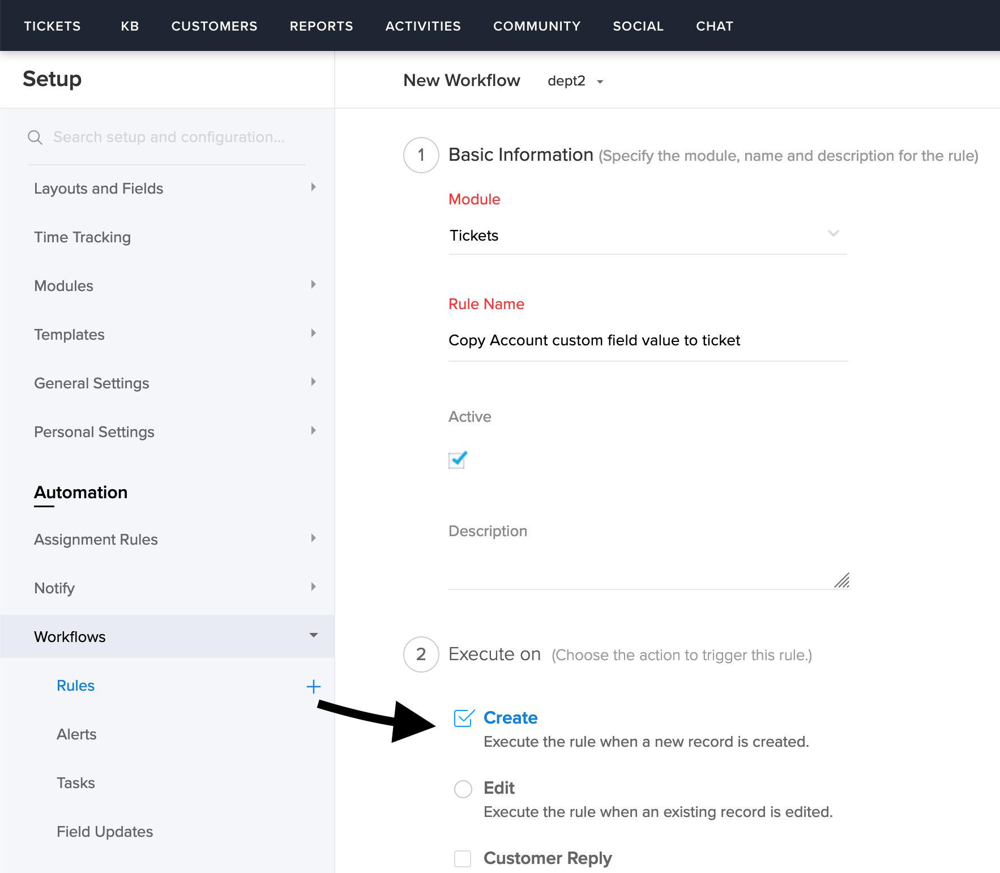
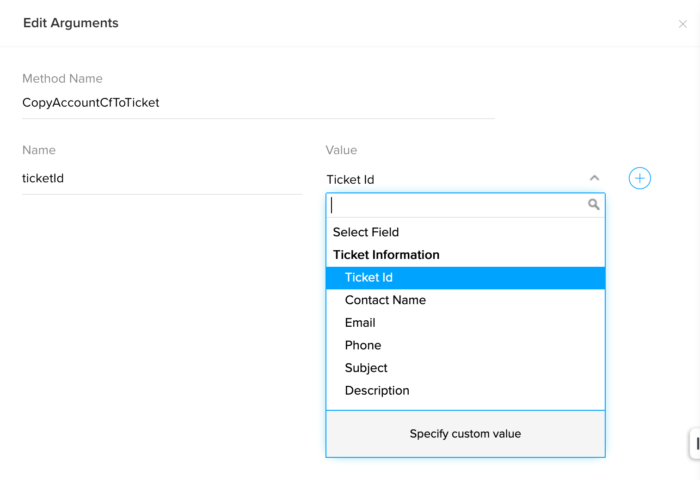
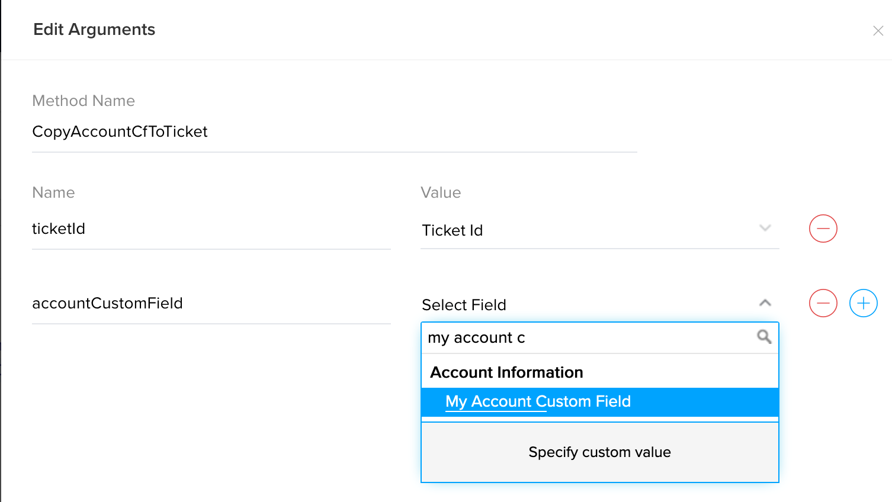
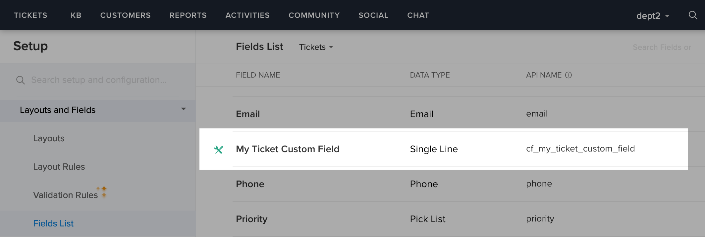

# Copy Account custom field value to ticket's custom field

## Description
On ticket creation, the custom field value of an account is copied to the ticket's custom field.


### Module : Tickets
### Workflow Trigger : On Create
Create workflow in Tickets module. 



### Workflow Action


### Arguments : 
* ticketId - Choose Ticket Id
* accountCustomField - Choose Account Custom Field




## Deluge Script
```javascript
ORGID = 123456; // Replace OrgId
ticketCustomFieldApiName = "cf_my_ticket_custom_field";
mapData = {"cf":{ticketCustomFieldApiName : accountCustomField}};
response = zoho.desk.update(ORGID,"tickets",ticketId,mapData);
```

## Notes
This function uses Desk Integration Task for updating the ticket.

## FAQ
### How to get OrgId?
see [Organizations API](https://desk.zoho.com/support/APIDocument.do#Organizations)

### How to get custom field API name?
Goto Setup > Layouts and Fields > Fields List
Choose the module




## Help Urls
[Deluge Script](https://www.zoho.com/deluge/help/)

[DRE Functions](https://dre.zoho.com/help/)

[Desk API Documentation](https://desk.zoho.com/support/APIDocument.do)

[Desk Integration Tasks](https://www.zoho.com/deluge/help/desk-tasks.html)
